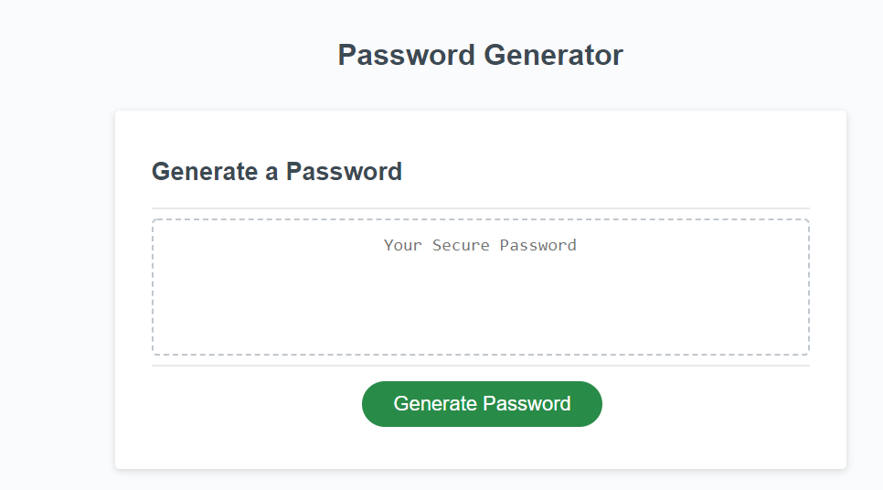

# The Password Generator 

## 3rd homework for Trilogy labs week 3 javaScript. 

 I was to create a password generator that met the below requirments. 

WHEN I click the button to generate a password

```
THEN I am presented with a series of prompts for password criteria
```

WHEN prompted for password criteria

```
THEN I select which criteria to include in the password
```

WHEN prompted for the length of the password

```
THEN I choose a length of at least 8 characters and no more than 128 characters
```

WHEN prompted for character types to include in the password

```
THEN I choose lowercase, uppercase, numeric, and/or special characters
```

WHEN I answer each prompt

```
THEN my input should be validated and at least one character type should be selected
```

WHEN all prompts are answered


```
THEN a password is generated that matches the selected criteria
```

WHEN the password is generated

```
THEN the password is either displayed in an alert or written to the page
```

To accomplish this I used all  JavaScript for this assignment, it reviewed the javaScript basics we have learned the first two weeks. Variables. Arrays, For Loops, Functions, operators, Conditionals, and Event Listners. 

The App is fully functioning and will generate you a random password based on the charachter selections you choose. You start by pression Generate Password, this button will prompt you 5 questions. from these questions you will be returned a random password. 

Img of what the password generator will look like 


Link to my Deployed Site: https://firzlaff.github.io/Homework03Password-Generator/Develop/index.html